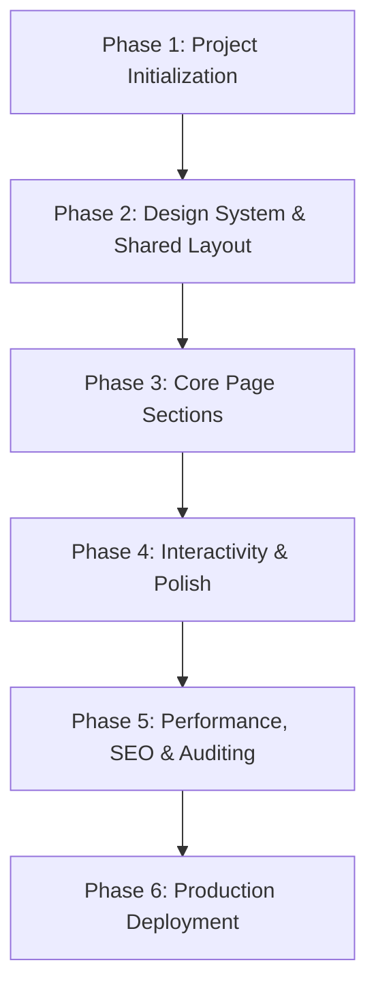

# Development Plan 01: Next.js Portfolio Website Roadmap

## 1. Executive Summary & Objectives

This document establishes the overarching architecture, technology stack, feature specifications, and phased rollout roadmap for building a modern, high-performance personal portfolio website using Next.js.

### Key Objectives

- **Modern & Responsive:** Seamless viewing experience across mobile, tablet, and ultra-wide displays.
- **Fast & Accessible:** 95+ Google Lighthouse scores across Performance, Accessibility, Best Practices, and SEO.
- **Interactive & Engaging:** Tasteful micro-interactions, smooth scrolling, and page transitions powered by Framer Motion.
- **Maintainable & Extensible:** Modular component architecture with clean separation of content (data files/MDX) and presentation.

---

## 2. Recommended Tech Stack

| Category | Technology | Rationale |
| :--- | :--- | :--- |
| **Framework** | **Next.js (App Router)** | Modern React Server Components (RSC), optimized routing, built-in image & font optimization. |
| **Language** | **TypeScript** | Strict typing for reliability, better developer experience, and maintainable schemas. |
| **Styling** | **Tailwind CSS** | Utility-first styling with rapid prototyping, custom design tokens, and small bundle size. |
| **UI Components & Icons** | **Lucide React / Radix UI** | Accessible, unstyled primitives with high-quality, consistent icons. |
| **Animation** | **Motion** | React 19-compatible viewport reveals, layout transitions, and reduced-motion-aware interaction. |
| **Theme Handling** | **next-themes** | Zero-flicker dark/light mode toggle with system preference detection. |
| **Form Handling** | **Native HTML + Next.js Route Handler** | Progressive client validation, server validation, Resend delivery, and a mail-client fallback. |
| **Deployment** | **Vercel** | Seamless edge deployment, automatic SSL, preview environments, and analytics. |

---

## 3. Core Features & Page Structure

### 3.1 Global Elements

- **Sticky Navigation Bar:** Logo/monogram, desktop navigation links, mobile hamburger drawer, and theme switch toggle (Light/Dark).
- **Footer:** Copyright, quick links, social media channels, "Built with Next.js & Tailwind", and back-to-top button.
- **SEO & Meta Tags:** OpenGraph image generator, dynamic metadata, Twitter card tags, `sitemap.ts`, and `robots.ts`.

### 3.2 Key Sections

1. **Hero Section:**
   - Compelling headline and sub-headline highlighting role and expertise.
   - Call to action (CTA) buttons: "View Work" and "Contact Me" / "Download Resume".
   - Quick links to GitHub, LinkedIn, X/Twitter, and Email.
   - Interactive visual element or avatar illustration.

2. **About Me:**
   - Professional bio, background story, and design/engineering philosophy.
   - Quick highlights: years of experience, projects completed, core domains.

3. **Skills & Tech Stack:**
   - Categorized skills: Frontend, Backend, Tools & DevOps, Design.
   - Interactive badge display with icons, skill level, or categorized filtering.

4. **Featured Projects Showcase:**
   - Project cards featuring thumbnail, title, problem statement, key features, and tech stack tags.
   - External links: Live Demo, GitHub Repository, Case Study.
   - Category filtering (e.g., "Full Stack", "Frontend", "Mobile", "Open Source").

5. **Work Experience & Education (Timeline):**
   - Chronological vertical timeline detailing roles, company names, tenures, and key achievements.

6. **Contact Section:**
   - Interactive contact form (Name, Email, Subject, Message) with client-side validation.
   - Direct contact info (Email, Location, Schedule a Call link via Cal.com / Calendly).

---

## 4. Proposed Directory Structure

```text
Portfolio-Site/
├── development-plans/
│   └── development-plan-01.md
├── public/
│   ├── images/
│   │   ├── avatar.webp
│   │   └── projects/
│   ├── og-image.png
│   ├── resume.pdf
│   └── favicon.ico
├── src/
│   ├── app/
│   │   ├── layout.tsx
│   │   ├── page.tsx
│   │   ├── globals.css
│   │   ├── robots.ts
│   │   └── sitemap.ts
│   ├── components/
│   │   ├── common/
│   │   │   ├── Container.tsx
│   │   │   ├── SectionHeading.tsx
│   │   │   └── ThemeToggle.tsx
│   │   ├── layout/
│   │   │   ├── Navbar.tsx
│   │   │   ├── MobileNav.tsx
│   │   │   └── Footer.tsx
│   │   └── sections/
│   │       ├── Hero.tsx
│   │       ├── About.tsx
│   │       ├── Skills.tsx
│   │       ├── Projects.tsx
│   │       ├── Experience.tsx
│   │       └── Contact.tsx
│   ├── data/
│   │   ├── personal.ts
│   │   ├── skills.ts
│   │   ├── projects.ts
│   │   └── experience.ts
│   ├── hooks/
│   │   └── useScrollSpy.ts
│   ├── lib/
│   │   └── utils.ts
│   └── types/
│       └── index.ts
├── tailwind.config.ts
├── tsconfig.json
├── package.json
└── README.md
```

---

## 5. Phased Implementation Roadmap



### Phase 1: Project Initialization & Setup

- [x] Initialize Next.js project using `create-next-app` with App Router, TypeScript, and Tailwind CSS.
- [x] Install utility packages: `lucide-react`, `clsx`, `tailwind-merge`, `motion`, and `next-themes`.
- [x] Configure ESLint, TypeScript strict mode, Vitest, and absolute path aliases (`@/*`).

### Phase 2: Design Tokens & Base Layout

- [x] Configure Tailwind CSS v4 tokens and dark-mode variants in `src/app/globals.css`.
- [x] Implement `ThemeProvider` for seamless dark/light theme switching.
- [x] Build global `Navbar`, `MobileNav`, and `Footer` components.

### Phase 3: Content Architecture & Core Sections

- [x] Setup structured TypeScript data files in `src/data/` for projects, skills, and experience.
- [x] Implement `Hero`, `About`, and `Skills` components.
- [ ] Implement `Projects` section with tag-based filtering.
- [x] Implement `Experience` timeline component.
- [x] Implement `Contact` component with client/server validation and delivery fallback.

### Phase 4: Interactivity & Animations

- [x] Add smooth entry animations and viewport reveal transitions using Motion.
- [ ] Add interactive hover effects, tilt cards, or active section highlighting (`useScrollSpy`).
- [x] Configure form feedback states (loading, success, fallback, and error).

### Phase 5: SEO, Optimization & Polish

- [x] Configure metadata in `layout.tsx`, dynamic OpenGraph images, `sitemap.ts`, and `robots.ts`.
- [x] Self-host and optimize Geist fonts through the `geist` package.
- [ ] Run Lighthouse audits for accessibility, contrast ratios, and Core Web Vitals.

### Phase 6: Final Review & Deployment

- [x] Verify production build (`npm run build`).
- [ ] Setup Vercel deployment and custom domain configuration.

---

## 6. Development Plan Naming Convention

All subsequent planning and tracking documents will follow the established standard:

- Pattern: `development-plans/development-plan-xx.md` (e.g., `development-plan-02.md`, `development-plan-03.md`, etc.).
- Each plan will chronicle specific milestones, architectural changes, or feature updates.
